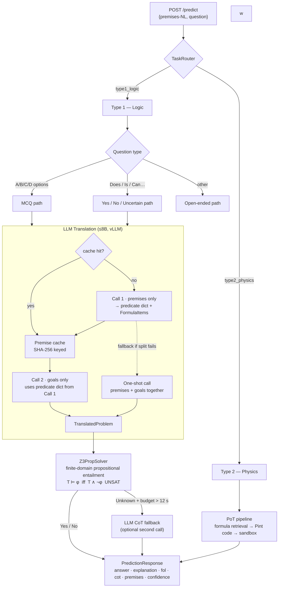

# EXACT 2026 system

Hybrid neuro-symbolic pipeline for the [EXACT 2026](https://ura.hcmut.edu.vn/exact) challenge (transparent educational QA).

---

## Pipeline Overview

### System topology

```
Evaluator (BTC)
    │  POST /predict
    ▼
Cloudflare Tunnel ──► EXACT FastAPI  :8080   (uvicorn)
                           │
                           │  OpenAI-compatible  HTTP
                           ▼
                       vLLM server   :8000   (Qwen 2.5-7B-AWQ)
```

### Request flow



### Type 1 — key design decisions

| Decision | Rationale |
|---|---|
| **Split translation (2 calls)** | Premise call cached by SHA-256 — 2nd question in same group reuses it (~0 LLM time vs ~40 s). |
| **Shared predicate dict** | Goals call receives the predicate vocabulary from Call 1 → no vocabulary drift between premises and query. |
| **Z3 propositional entailment** | Finite-domain grounding turns universally-quantified formulas into ground Boolean constraints. Sound and fast (ms). |
| **Deadline guard** | Optional CoT / MCQ LLM fallback is skipped if remaining time < 12 s → always returns symbolic answer within 60 s cap. |
| **Formula IR** | Recursive `Atom / Not / And / Or / Implies` tree replaces flat Horn atoms → handles MCQ options that are implications (contrapositives, conditionals). |

---

## Layout

- `src/exact/` — core library (`exact.config`, pipelines, solvers)
- `src/exact/app/` — FastAPI service (`uvicorn exact.app.main:app`)
- `src/exact/datasets/` — datasets and normalized loaders
- `artifacts/` — prediction and evaluation outputs
- `docs/` — challenge notes and experiment logs
- `papers/` — paper drafts and references

## Quick start

```bash
python -m venv .venv && source .venv/bin/activate
pip install -r requirements.txt
# or: pip install -e ".[api,dev]"
cp .env.example .env
PYTHONPATH=src uvicorn exact.app.main:app --host 0.0.0.0 --port 8080
```

Health check: `GET http://localhost:8080/health`

The API exposes:

- `GET /health`
- `POST /predict` — official EXACT response shape
- `POST /batch` — official EXACT response shape for multiple instances
- `POST /debug/predict` — internal response with debug metadata
- `POST /debug/batch` — internal response with debug metadata

Official predictions return `answer` and `explanation`, plus optional `fol`,
`cot`, `premises`, and `confidence`. Local metadata such as `id`, `task_type`,
`question_type`, `unit`, and `error` is available from the `/debug/*` routes.

Configure a local OpenAI-compatible LLM server for real predictions:

```bash
export EXACT_LLM_BASE_URL=http://127.0.0.1:8000/v1
export EXACT_LLM_MODEL=Qwen/Qwen2.5-7B-Instruct
```

## Docker with remote vLLM

The Docker image runs only the EXACT API. Host vLLM separately on a VM or GPU
machine that exposes an OpenAI-compatible endpoint.

Build the API image:

```bash
docker build -t exact2026-api .
```

Run it against a vLLM server on another VM:

```bash
docker run --rm -p 8080:8080 \
  -e EXACT_LLM_BASE_URL=http://VM_PRIVATE_IP_OR_DNS:8000/v1 \
  -e EXACT_LLM_MODEL=Qwen/Qwen2.5-7B-Instruct \
  -e EXACT_LLM_API_KEY=EMPTY \
  exact2026-api
```

If vLLM is running on the same host as Docker, use Docker's host gateway:

```bash
docker run --rm -p 8080:8080 \
  --add-host=host.docker.internal:host-gateway \
  -e EXACT_LLM_BASE_URL=http://host.docker.internal:8000/v1 \
  -e EXACT_LLM_MODEL=Qwen/Qwen2.5-7B-Instruct \
  -e EXACT_LLM_API_KEY=EMPTY \
  exact2026-api
```

The vLLM side should listen on a reachable interface, for example:

```bash
vllm serve Qwen/Qwen2.5-7B-Instruct \
  --host 0.0.0.0 \
  --port 8000 \
  --served-model-name Qwen/Qwen2.5-7B-Instruct
```

For the VM + Cloudflare Tunnel deployment path, see
[`deployment/vllm-cloudflare.md`](deployment/vllm-cloudflare.md). The recommended topology
is to keep vLLM private and expose only the EXACT FastAPI `/predict` endpoint.

Type 1 is LLM-only: if no JSON LLM client is configured, the request fails with
a clear error instead of substituting a local parser.

Type 2 uses a PoT-first physics pipeline: formula retrieval, LLM-generated Pint
code, sandbox execution, answer/unit/formula verification, and evidence
generation.

Example Type 1 request:

```bash
curl -X POST http://127.0.0.1:8080/predict \
  -H "Content-Type: application/json" \
  -d '{
    "id": "t1_001",
    "premises-NL": [
      "If a curriculum is well-structured and has exercises, it enhances student engagement.",
      "The curriculum is well-structured.",
      "The curriculum has exercises."
    ],
    "question": "Does the curriculum enhance student engagement?"
  }'
```

Example Type 2 request:

```bash
curl -X POST http://127.0.0.1:8080/predict \
  -H "Content-Type: application/json" \
  -d '{
    "id": "t2_001",
    "question": "Calculate the current when U = 12 V and R = 6 ohm."
  }'
```

## Tests

```bash
pytest
```

## Type 2 Dataset Runs

```bash
cp configs/type2_dataset_run.example.toml configs/type2_local.toml
PYTHONPATH=src python -m exact.scripts.run_dataset_from_config --config configs/type2_local.toml
```

Evaluate a Type 2 prediction file with the tolerances configured in the same
TOML file:

```bash
PYTHONPATH=src python -m exact.scripts.evaluate_type2_predictions \
  artifacts/predictions/type2/type2_config_smoke.json \
  --config configs/type2_local.toml
```

Monitor a Type 2 run with live correct/wrong/error counters:

```bash
PYTHONPATH=src python -m exact.scripts.run_type2_monitor \
  --config configs/type2_local.toml
```

Useful settings in `configs/type2_local.toml`:

- `llm.backend = "transformers"` loads a Hugging Face model directly.
- `llm.backend = "ollama"` calls an Ollama OpenAI-compatible endpoint.
- `llm.backend = "groq"` calls Groq's OpenAI-compatible API.
- `llm.backend = "openai_compatible"` calls a local/cloud GPU server such as vLLM.
- `llm.backend = "huggingface"` calls Hugging Face's OpenAI-compatible router.
- `pipeline.use_type2_llm_fallback = true` enables Type 2 PoT-first solving:
  formula retrieval, LLM-generated Pint code, sandbox execution, PoT
  verification, and final LLM evidence generation.
- `type2_pipeline.generate_final_explanation = false` skips the final
  explanation/evidence LLM call for faster smoke runs.

For CPU smoke tests with transformers, start with a small model:

```toml
[llm]
enabled = true
backend = "transformers"
model = "Qwen/Qwen2.5-0.5B-Instruct"
device_map = "cpu"
torch_dtype = "float32"

[pipeline]
use_type1_llm = true
use_type2_llm_fallback = true
```

To download/cache the configured Hugging Face model first:

```bash
PYTHONPATH=src python -m exact.scripts.pull_model --config configs/type2_local.toml
```

For Ollama:

```toml
[llm]
enabled = true
backend = "ollama"
model = "qwen2.5:0.5b"
base_url = "http://127.0.0.1:11434/v1"
```

For a cloud or LAN GPU server exposing an OpenAI-compatible API:

```toml
[llm]
enabled = true
backend = "openai_compatible"
model = "Qwen/Qwen2.5-7B-Instruct"
base_url = "http://YOUR_SERVER:8000/v1"
api_key = "EMPTY"
```

For Groq:

```toml
[llm]
enabled = true
backend = "groq"
model = "llama-3.1-8b-instant"
api_key_env = "GROQ_API_KEY"
```
