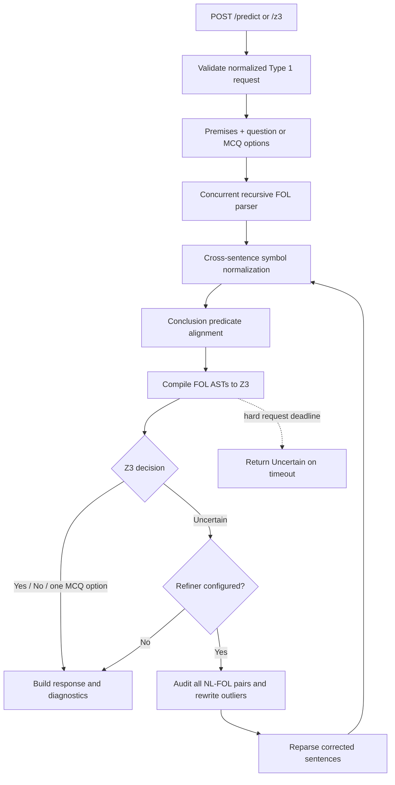
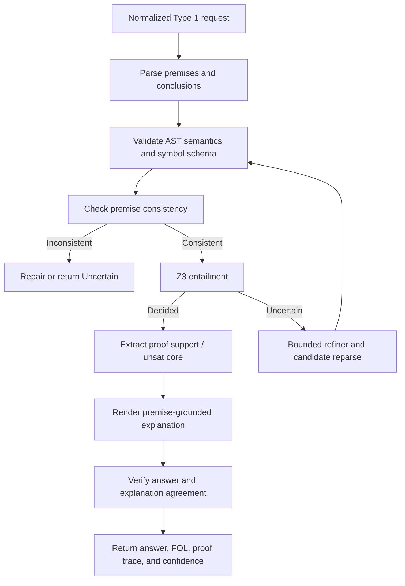

# Type 1 Solution: Neuro-Symbolic FOL and Z3 Pipeline

Implementation snapshot: June 13, 2026

## 1. Scope

The EXACT Type 1 task asks the system to answer logical questions from a set of
natural-language premises. Questions may be:

- **YNU**: return `Yes`, `No`, or `Uncertain`.
- **MCQ**: return the single option label entailed by the premises.

The current solution is a bounded neuro-symbolic pipeline:

1. A small language model translates each sentence into a recursive
   first-order-logic abstract syntax tree.
2. Deterministic normalization repairs symbol drift across independently parsed
   sentences.
3. Z3 decides whether the conclusion is entailed, contradicted, or undecidable.
4. When Z3 is uncertain, a larger language model may rewrite inconsistent
   natural-language sentences, after which the parser and Z3 solver run once
   more.

The language models are translators and repair tools. Z3 remains the answer
decision maker.

## 2. Design Goals

The Type 1 branch is designed around five constraints:

- **Faithful reasoning**: final decisions should follow executable logic rather
  than unconstrained language-model reasoning.
- **Small-model compatibility**: all model components must remain within the
  challenge's model-size limit.
- **Conservative uncertainty**: malformed translations, solver failures, and
  insufficient evidence should return `Uncertain`.
- **Bounded latency**: every request runs under a hard end-to-end deadline.
- **Debuggability**: responses expose parsed FOL, ASTs, normalization logs, and
  refinement activity.

## 3. Active Architecture



### Runtime Components

| Component | Responsibility | Implementation |
|---|---|---|
| API router | Routes Type 1 requests and injects shared services | `src/exact/app/router.py` |
| Pipeline orchestrator | Parse, normalize, solve, refine, and format response | `src/exact/type1/pipeline.py` |
| Fast classifier | Routes a sentence to atomic, logical, or quantified parsing | `src/exact/type1/ast/classifier.py` |
| Recursive parser | Builds the FOL AST and performs deterministic repairs | `src/exact/type1/parser/parser.py` |
| Parser client | Calls the dedicated parser vLLM with structured JSON schemas | `src/exact/type1/parser/client.py` |
| FOL AST | Represents atomic, logical, and quantified formulas | `src/exact/type1/ast/nodes.py` |
| Z3 solver | Compiles ASTs and performs entailment checks | `src/exact/type1/solvers/z3_solver.py` |
| Refiner | Rewrites inconsistent natural-language translations | `src/exact/type1/refiner/refiner.py` |
| Prompts | Defines narrow parser and refiner tasks | `src/exact/type1/prompts.py` |

`src/exact/type1/llm_head.py` contains a direct LLM answer fallback, but it is
not currently wired into the active pipeline.

## 4. Request and Response Contract

The API expects a normalized `PredictionRequest`. Raw dataset fields such as
`premises-NL` must be converted to `premises` before calling the API.

### YNU Request

```json
{
  "id": "logic-1",
  "type": "type1",
  "premises": [
    "All students who study hard pass the exam.",
    "Alice studies hard."
  ],
  "question": "Does Alice pass the exam?"
}
```

### MCQ Request

MCQ options must be supplied separately. Dataset questions that embed
`A.`, `B.`, and `C.` lines require preprocessing.

```json
{
  "id": "logic-2",
  "type": "type1",
  "premises": [
    "All students who study hard pass the exam.",
    "Alice studies hard."
  ],
  "question": "Which conclusion follows?",
  "options": {
    "A": "Alice passes the exam.",
    "B": "Alice does not pass the exam."
  }
}
```

The response includes the competition-facing answer plus implementation
diagnostics:

```json
{
  "answer": "Yes",
  "explanation": "Z3 entailment result: Yes",
  "fol": "premise-1: ...\npremise-2: ...\nquestion: ...",
  "cot": [
    "Parsed all sentences concurrently.",
    "Z3 solver returned: Yes"
  ],
  "premises": ["..."],
  "confidence": null,
  "task_type": "type1_logic",
  "question_type": "ynu",
  "routing_diagnostics": {
    "stage": "z3_entailment",
    "answered_by": "z3",
    "predicate_renames": [],
    "symbol_normalizations": [],
    "refinement_log": [],
    "parsed_premises": [],
    "parsed_conclusions": []
  }
}
```

## 5. First-Order Logic Representation

The parser produces a small recursive AST:

```text
FOLNode     ::= AtomicNode | LogicalNode | QuantifiedNode

AtomicNode  ::= Predicate(arguments...)

LogicalNode ::= NOT(FOLNode)
              | FOLNode AND FOLNode
              | FOLNode OR FOLNode
              | FOLNode IMPLIES FOLNode
              | FOLNode IFF FOLNode

QuantifiedNode ::= FORALL variable . FOLNode
                 | EXISTS variable . FOLNode
```

Examples:

```text
Alice studies.
=> Studies(Alice)

Alice does not study.
=> NOT(Studies(Alice))

If a student studies, then he passes.
=> FORALL x . (Studies(x) IMPLIES Passes(x))
```

Every entity currently uses one shared Z3 sort named `Entity`. Predicates are
distinguished by name and arity.

## 6. End-to-End Algorithm

### 6.1 Normalize the Problem

The pipeline:

1. Removes empty premises.
2. Rejects a request with no usable premise.
3. Normalizes MCQ options into a `{label: text}` dictionary.
4. Uses the question as the single conclusion for YNU.
5. Uses each option text as a separate conclusion for MCQ.

All premises and conclusions are sent to `FOLParser.parse_many()` in one ordered
batch.

### 6.2 Concurrent Recursive Semantic Parsing

The parser first applies deterministic regular-expression rules to classify each
sentence as:

- `atomic`
- `logical`
- `quantified`

Each class has a narrow structured-output prompt and Pydantic schema.

#### Atomic Parsing

The model extracts:

```json
{
  "predicate": "Passes",
  "arguments": ["Alice", "Exam"],
  "negated": false
}
```

Arguments are normalized into variables or CamelCase constants. A negative
atomic result becomes a `NOT` node around the positive atom.

#### Logical Parsing

The model splits only the outermost operator. The parser recursively parses the
operands.

For implications, the left side is parsed first because it may introduce a
bound variable used by the right side. Pronouns on the right are replaced with
that bound variable, and a quantifier on the left is lifted over the complete
logical expression.

#### Quantified Parsing

The model extracts one outer quantifier, one variable, and a remaining scope
sentence. The parser recursively parses the scope.

Quantified sentences are batch-rephrased before recursive parsing when a
minimal rewrite can convert them into a clearer logical form.

#### Parser Safety Guards

The parser prevents one malformed sentence from failing the complete problem:

- Independent sentences are parsed concurrently while preserving order.
- Recursive parsing stops at a maximum depth.
- Near-identical parent and child sentences are treated as recursion loops.
- Quantifier scopes that do not become meaningfully shorter are parsed
  atomically.
- Double negations are simplified.
- Any per-sentence exception becomes an opaque zero-arity predicate. Z3 then
  treats that sentence as unknown instead of crashing the request.

### 6.3 Deterministic Cross-Sentence Normalization

The parser handles sentences independently, so equivalent symbols may differ in
casing or plurality:

```text
PhDDegree / PhdDegree
Student / Students
```

Before solving, `_normalize_symbols()` groups predicates by lowercase name and
arity, groups constants by lowercase name, and rewrites spelling variants to
the most common form.

This step is deterministic and does not attempt semantic synonym resolution.
For example, it can merge `PhDDegree` with `PhdDegree`, but not `Has` with
`Holds`.

### 6.4 Conclusion Predicate Alignment

Conclusions are parsed independently from premises and may use a slightly
different predicate phrase. `_align_predicates()` compares conclusion and
premise predicate names using CamelCase word-set Jaccard similarity.

Only predicates with the same arity are compared. A conclusion predicate is
renamed when similarity is at least `0.6`.

Example:

```text
Premise predicate:    QualifiesForScholarship
Conclusion predicate: QualifyForScholarship
```

The rename is recorded in `routing_diagnostics.predicate_renames`.

### 6.5 Compile to Z3

The solver recursively translates the AST:

| FOL AST | Z3 |
|---|---|
| Atomic predicate | Uninterpreted Boolean function |
| Constant | Constant of sort `Entity` |
| Variable | Bound Z3 constant |
| `NOT` | `z3.Not` |
| `AND` | `z3.And` |
| `OR` | `z3.Or` |
| `IMPLIES` | `z3.Implies` |
| `IFF` | Two implications |
| `FORALL` | `z3.ForAll` |
| `EXISTS` | `z3.Exists` |

Free variables in premises are closed universally before solving. This repairs
rules such as:

```text
Studies(x) IMPLIES Passes(x)
```

by treating them as:

```text
FORALL x . (Studies(x) IMPLIES Passes(x))
```

Each Z3 check has a default timeout of 2 seconds.

### 6.6 YNU Decision Rule

For premises `P` and conclusion `C`:

1. If `P AND NOT(C)` is unsatisfiable, return `Yes`.
2. Otherwise, if `P AND C` is unsatisfiable, return `No`.
3. Otherwise, return `Uncertain`.

This is open-world logical entailment. A conclusion is not false merely because
it cannot be proven.

### 6.7 MCQ Decision Rule

Each option is checked independently for entailment.

- If exactly one option is entailed, return its label.
- If zero or multiple options are entailed, return `Uncertain`.

The solver does not currently implement challenge-specific ranking such as
"strongest conclusion" or "fewest premises." It only checks entailment.

### 6.8 Self-Refinement Retry

When Z3 returns `Uncertain` and the general LLM endpoint is configured, the
pipeline sends every natural-language/FOL pair to `Type1Refiner`.

The refiner looks for:

- Predicate synonyms that should share one wording.
- Entity-name drift.
- Conclusion/premise concept mismatches.
- Structural translation errors such as tautologies.
- Constants used where a bound variable should appear.

The refiner returns corrected natural-language sentences only. The small parser
then reparses only the corrected items. The pipeline normalizes symbols, aligns
conclusion predicates, and calls Z3 one final time.

The refiner cannot directly choose the answer.

### 6.9 Deadline and Failure Behavior

The complete parse, solve, refine, and retry flow runs inside
`asyncio.wait_for()`.

The default hard deadline is 55 seconds and is configurable with:

```dotenv
EXACT_TYPE1_DEADLINE_SECONDS=55
```

If the deadline is exceeded, the pipeline cancels the in-flight work and
returns `Uncertain` with `routing_diagnostics.stage = "deadline_exceeded"`.

Solver exceptions also degrade to `Uncertain`.

## 7. Deployment Model

The API creates shared Type 1 services during FastAPI startup:

- One persistent parser HTTP client.
- One recursive `FOLParser`.
- One reusable `FOLSolver`.
- One optional `Type1Refiner`.

The dedicated parser service defaults to `Qwen/Qwen3-1.7B` served through vLLM.
It is separate from the general 7B model used by the refiner.

Important settings:

```dotenv
EXACT_TYPE1_PARSER_BASE_URL=http://127.0.0.1:8001/v1
EXACT_TYPE1_PARSER_MODEL=type1-parser
EXACT_TYPE1_PARSER_API_KEY=exact-parser-token
EXACT_TYPE1_PARSER_CONCURRENCY=32
EXACT_TYPE1_PARSER_TIMEOUT_SECONDS=30
EXACT_TYPE1_PARSER_MAX_RETRIES=2
EXACT_TYPE1_PARSER_MAX_TOKENS=512
EXACT_TYPE1_DEADLINE_SECONDS=55
```

The checked-in `.env.example` lowers parser output to 80 tokens as a deployment
optimization; the application setting defaults to 512.

Start the parser service:

```bash
bash scripts/serve_type1_parser.sh
```

Run a parser smoke test:

```bash
PYTHONPATH=src python scripts/test_type1_parser.py
```

Parser calls use:

- One persistent `httpx.AsyncClient`.
- An application semaphore for backpressure.
- vLLM continuous batching.
- Pydantic JSON schemas through OpenAI-compatible `response_format`.
- Bounded retries for transient transport and server failures.

## 8. Diagnostics and Explanation

The current response exposes useful debugging artifacts:

- Original and possibly refined premise text.
- Printable FOL for every premise and conclusion.
- JSON-safe recursive ASTs.
- Predicate rename log.
- Symbol normalization log.
- Refinement log.
- Parser, solver, and refiner availability.

The current natural-language explanation is intentionally minimal:

```text
Z3 entailment result: Yes
```

This is faithful but not judge-friendly. The solver currently returns only a
decision, not a proof or unsatisfiable core, so it cannot yet identify the exact
supporting premises.

## 9. Current Strengths

- The answer is normally selected by an executable symbolic solver.
- YNU correctly distinguishes contradiction from lack of evidence.
- Parsing work is parallelized across premises and conclusions.
- Parser outputs are constrained and validated with narrow JSON schemas.
- Symbol normalization repairs common small-model inconsistencies without
  another LLM call.
- The refiner operates only after an uncertain symbolic result.
- Every request has bounded latency and graceful uncertainty behavior.
- Responses expose enough intermediate state for systematic error analysis.

## 10. Known Limitations

### 10.1 Quantified Class Semantics Are Lossy

The quantified parser prompt intentionally removes domain/type predicates.
Consequently:

```text
Every student studies.
```

may become:

```text
FORALL x . Studies(x)
```

instead of:

```text
FORALL x . (Student(x) IMPLIES Studies(x))
```

This can overgeneralize rules and produce incorrect entailments.

### 10.2 Semantic Alignment Is Narrow

Deterministic normalization handles spelling, casing, and plurality variants.
Conclusion alignment handles similar CamelCase phrases. Neither reliably
resolves true synonyms, paraphrases, or ontology differences.

### 10.3 MCQ Semantics Are Incomplete

The solver only identifies a uniquely entailed option. It does not model
instructions such as:

- strongest conclusion
- follows with the fewest premises
- best explanation
- most plausible conclusion

Embedded MCQ options are not extracted by the API pipeline and must be
preprocessed into `options`.

### 10.4 No Proof Trace or Premise Attribution

Z3 returns a decision, but the pipeline does not request an unsatisfiable core
or reconstruct a proof. The response therefore cannot yet produce a faithful
premise-by-premise explanation.

### 10.5 Inconsistent Premises Need Explicit Handling

The solver does not first check whether the premise set itself is satisfiable.
Under classical logic, an inconsistent premise set can entail any conclusion.
The pipeline needs an explicit consistency check before trusting a `Yes`.

### 10.6 The Direct LLM Answer Head Is Dormant

`Type1LLMHead` exists, but the active FastAPI lifecycle and pipeline do not call
it. This is preferable to silently overriding Z3, but the dead component should
either be removed or reintroduced behind an explicit, evaluated fallback
policy.

### 10.7 Test Contract Drift

The focused Type 1 test suite currently reports:

```text
16 passed, 2 failed
```

The failures reflect expectations that no longer match the active behavior:

- A quantified implication now lifts the quantifier over the complete
  implication, while the test still expects a top-level `LogicalNode`.
- The pipeline now parses the YNU question as a conclusion, while the test still
  expects only premises to be sent to the parser.

There are no focused tests yet for Z3 entailment, symbol normalization,
predicate alignment, refinement, timeout behavior, or inconsistent premises.

## 11. Recommended Next Work

### Priority 0: Establish Correctness

1. Update stale tests to match the active parser and pipeline contract.
2. Add direct tests for `FOLSolver.check_ynu()` and `check_mcq()`.
3. Preserve noun-class predicates when translating quantified statements.
4. Add a premise-consistency check before entailment.
5. Add API-boundary parsing for MCQ options embedded in question text.
6. Add regression tests from representative Type 1 dataset records.

### Priority 1: Produce Faithful Explanations

1. Track each compiled Z3 formula back to its premise ID.
2. Use assumption literals or unsatisfiable cores to identify supporting
   premises.
3. Render a short proof trace from the solver result.
4. Verify that the rendered explanation cites only premises used by the proof.

### Priority 2: Improve Translation Reliability

1. Evaluate parser output against available gold `premises-FOL`.
2. Add semantic schema validation before Z3 compilation.
3. Generate multiple candidate parses only for uncertain or invalid cases.
4. Rerank candidates using consistency and solver outcomes.
5. Add explicit handling for contraposition, exceptions, thresholds, and
   challenge-specific educational rule patterns.

### Priority 3: Evaluate and Calibrate

Track at least:

- YNU and MCQ answer accuracy.
- FOL executable rate.
- Atomic, logical, and quantified parser accuracy.
- Initial Z3 decision rate.
- Refinement recovery rate.
- Incorrect confident-decision rate.
- Timeout rate.
- Per-stage latency.
- Explanation premise-attribution precision and recall.

## 12. Target Competition-Grade Flow

The next stable architecture should retain the current parser/Z3 backbone while
adding explicit validation and proof rendering:



The core principle should remain unchanged:

> Use language models to translate and repair language; use symbolic execution
> to decide logic; use solver evidence to explain the answer.
