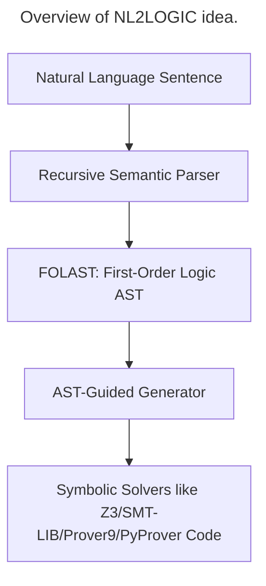

# Type 1: Logical Question with MCQ or YuN Types.
To solve this challenge, I adopted idea of [NL2Logic](https://arxiv.org/pdf/2602.13237). They proposed a framework that won't let LLM directly translate a ``NL-premises`` to ``First-Order Logic``, but they will leverage the advancement of LLM in reasoning for general-purpose problem to extract ``predicates`` to build a ``FOL Abstract Syntax Tree`` to improve quality of output.


```text
type1/
    __init__.py

    pipeline.py              # main run_type1_pipeline()
    schemas.py               # request/response + domain schema
    ast_nodes.py             # FOL AST node models
    prompts.py               # LLM prompts
    llm_client.py            # OpenAI/vLLM wrapper

    schema_builder.py        # NL premises → DomainSchema
    ast_parser.py            # NL sentence → AST
    ast_verifier.py          # validate AST against schema
    z3_compiler.py           # AST → Z3 expressions
    solver.py                # entailment, MCQ solving
    response_builder.py      # final response formatting

    errors.py
    utils.py
```



In this paper, their framework will parse a sentence or a document to three types: ``atomic`` - the smallest unit in the sentence, ``quantified`` - ∀, ForAll, Exists,..., ``logical``. 

For example:
```json
{
  "type": "atom",
  "predicate": "Passed",
  "args": ["Alice", "Logic"]
}
```
## 1.1 AST Grammar
They defines the ``FOLAST`` using small and simple grammar below:
```text
Term       ::= Variable | Constant

Atomic     ::= RelationName(Term)
             | RelationName(Term, Term)
             | RelationName(Term, Term, Term)

Quantified ::= ∀Variable. Formula
             | ∃Variable. Formula

Logical    ::= ¬Formula
             | Formula ∧ Formula
             | Formula ∨ Formula
             | Formula → Formula

Formula    ::= Atomic
             | Quantified
             | Logical
```
# 1.2 Preprocessing
Before parsing, the framework splits input documents into distinct sentences using an ``ML-based model`` called ``SaT (Segment any Text)``. Unlike simple rule-based splitters, ``SaT`` uses contextual and lexical cues to accurately distinguish real sentence endings from punctuation used in abbreviations or numeric expressions, preventing sentence fragmentation errors.

