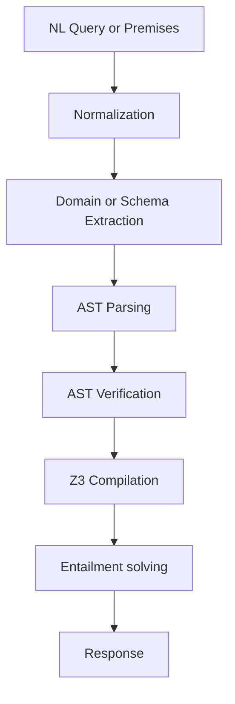
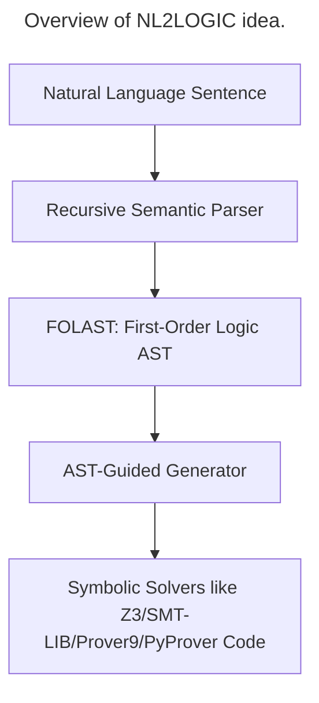

# Type 1: Logical Question with MCQ or YuN Types.
To solve this challenge, I adopted idea of [NL2Logic](https://arxiv.org/pdf/2602.13237). They proposed a framework that won't let LLM directly translate a ``NL-premises`` to ``First-Order Logic``, but they will leverage the advancement of LLM in reasoning for general-purpose problem to extract ``predicates`` to build a ``FOL Abstract Syntax Tree`` to improve quality of output.

Let LLM directly translate a natural language query to a FOL representation is a large picture. We need to decompose the problem into smaller subproblems include:


## Folder Structure
```text
type1/
    __init__.py

    pipeline.py              # main run_type1_pipeline()
    schemas.py               # request/response + domain schema
    ast_nodes.py             # FOL AST node models
    prompts.py               # LLM prompts
    llm_client.py            # Self-hosted vLLM client

    schema_builder.py        # NL premises → DomainSchema
    ast_parser.py            # NL sentence → AST
    ast_verifier.py          # validate AST against schema
    z3_compiler.py           # AST → Z3 expressions
    solver.py                # entailment, MCQ solving
    response_builder.py      # final response formatting

    errors.py
    utils.py
```

## Detail



In this paper, their framework will parse a sentence or a document to three types: ``atomic`` - the smallest unit in the sentence, ``quantified`` - ∀, ForAll, Exists,..., ``logical``. 

For example:
```json
{
  "type": "atom",
  "predicate": "Passed",
  "args": ["Alice", "Logic"]
}
```
## 1.1 AST Grammar
They defines the ``FOLAST`` using small and simple grammar below:
```text
Term       ::= Variable | Constant

Atomic     ::= RelationName(Term)
             | RelationName(Term, Term)
             | RelationName(Term, Term, Term)

Quantified ::= ∀Variable. Formula
             | ∃Variable. Formula

Logical    ::= ¬Formula
             | Formula ∧ Formula
             | Formula ∨ Formula
             | Formula → Formula

Formula    ::= Atomic
             | Quantified
             | Logical
```

## Parser Model Service

The Type 1 parser runs as a dedicated vLLM service. The serving script loads
the project `.env` automatically:

```bash
bash scripts/serve_type1_parser.sh
```

Use `EXACT_ENV_FILE` to load another environment file, or a `PARSER_*`
variable for a one-off override:

```bash
EXACT_ENV_FILE=/etc/exact/parser.env bash scripts/serve_type1_parser.sh
PARSER_GPU_MEMORY_UTILIZATION=0.35 bash scripts/serve_type1_parser.sh
```

For a CPU-only laptop smoke test, use the official vLLM CPU Docker image:

```bash
bash scripts/serve_type1_parser_cpu_docker.sh
```

In another terminal, run one concurrent atomic/quantified/logical batch:

```bash
PYTHONPATH=src exact/bin/python scripts/test_type1_parser.py
```

The application uses `ParserClient` with one persistent HTTP connection pool:

```python
from exact.type1.parser import ParserClient

parser = ParserClient(
    base_url="http://127.0.0.1:8001/v1",
    model="type1-parser",
    api_key="exact-parser-token",
    concurrency=32,
)
```

For application deployment, configure the parser independently:

```dotenv
EXACT_TYPE1_PARSER_BASE_URL=http://127.0.0.1:8001/v1
EXACT_TYPE1_PARSER_MODEL=type1-parser
EXACT_TYPE1_PARSER_API_KEY=exact-parser-token
EXACT_TYPE1_PARSER_CONCURRENCY=32

# vLLM process configuration
EXACT_TYPE1_PARSER_SOURCE_MODEL=Qwen/Qwen3-1.7B
EXACT_TYPE1_PARSER_SERVER_HOST=127.0.0.1
EXACT_TYPE1_PARSER_SERVER_PORT=8001
EXACT_TYPE1_PARSER_SERVER_MAX_MODEL_LEN=4096
EXACT_TYPE1_PARSER_SERVER_MAX_NUM_SEQS=64
EXACT_TYPE1_PARSER_SERVER_MAX_NUM_BATCHED_TOKENS=8192
EXACT_TYPE1_PARSER_SERVER_GPU_MEMORY_UTILIZATION=0.25
EXACT_TYPE1_PARSER_SERVER_DTYPE=auto
EXACT_TYPE1_PARSER_SERVER_QUANTIZATION=
EXACT_TYPE1_PARSER_SERVER_TENSOR_PARALLEL_SIZE=1
```

Then construct it once during application startup with
`build_parser_client_from_settings()` and close it during shutdown.

Use `parse_many_as()` to submit premises concurrently. The client semaphore
limits application pressure, while vLLM continuously batches active requests on
the GPU. Each call sends a Pydantic JSON schema to vLLM structured output, which
replaces client-side closing-brace stopping criteria.

System prompts remain in `exact.type1.prompts`. The prompt router selects the
correct prompt and response schema before calling the transport client:

```python
from exact.type1.parser import FOLParser, build_parser_client_from_settings

client = build_parser_client_from_settings()
if client is None:
    raise RuntimeError("EXACT_TYPE1_PARSER_BASE_URL is not configured")

parser = FOLParser(client)
trees = await parser.parse_many(premises)
```

`FOLParser.parse_many()` starts each independent premise concurrently. During
recursive parsing, each premise submits its next atomic, logical, quantified,
or coreference operation through the same `ParserClient`. The client semaphore
bounds request pressure and vLLM continuously batches active operations.

Create one shared client during application startup and close it during
shutdown. Do not create one client per premise:

```python
client = build_parser_client_from_settings()
parser = FOLParser(client)

try:
    first_problem_trees = await parser.parse_many(first_problem_premises)
    second_problem_trees = await parser.parse_many(second_problem_premises)
finally:
    await client.aclose()
```

For lower-level operations, `build_sentence_request()` deterministically
chooses `atomic`, `logical`, or `quantified`. Use `build_rephrase_request()`
and `build_coreference_request()` for explicit preprocessing operations.

# 1.2 Preprocessing
Before parsing, the framework splits input documents into distinct sentences using an ``ML-based model`` called ``SaT (Segment any Text)``. Unlike simple rule-based splitters, ``SaT`` uses contextual and lexical cues to accurately distinguish real sentence endings from punctuation used in abbreviations or numeric expressions, preventing sentence fragmentation errors.
