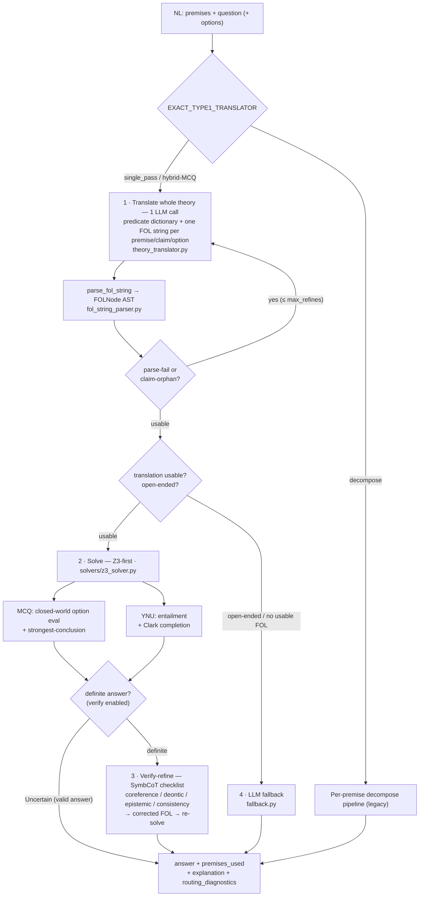

# Type 1 Solution — Neuro-Symbolic Logic QA (EXACT 2026)

How the Type 1 pipeline answers logic questions (MCQ / Yes-No-Uncertain / open-ended)
by translating natural language to first-order logic and deciding with Z3.

## Goal & constraints

- **Task:** Type 1 logic questions — MCQ (pick a label), YNU (Yes / No / Uncertain),
  open-ended (free-form).
- **Scoring:** `sample_score = 0.5·P1 + 0.5·P2`. **P1** = answer correct
  (`Unknown` ≡ `Uncertain`). **P2** = F1 over the 0-based `premises_used` index sets.
- **Latency budget:** ≤ 60 s per request.
- **Principle:** invest in *one good translation* and let **Z3 decide**; the LLM is a
  fallback, not the primary reasoner. A Z3 `Uncertain` on a faithful translation is a
  valid final answer, not a trigger to guess.

## Pipeline (single-pass, default)



Optional **self-consistency** (LINC): `EXACT_TYPE1_SELF_CONSISTENCY_SAMPLES > 1`
runs K translate→solve attempts and majority-votes; with adaptive-K it escalates
only when sample 1 is Uncertain.

## Methodology

We frame Type 1 as **neuro-symbolic entailment**: a language model performs *semantic
parsing* of the whole problem into first-order logic, and an SMT solver (Z3) performs
the *reasoning*. The model never decides the answer when the symbolic layer can; the
LLM only acts where logic does not apply (open-ended questions) or where parsing
failed. This keeps answers faithful and auditable, and makes failures attributable to
a single stage (translation vs reasoning).

### 0. Problem formulation

A request is a theory `T = (P, q, O)` with premises `P = [p₁ … pₙ]` (NL), a question
`q`, and optional MCQ options `O = {ℓ : oₗ}`. The system returns an answer `a` and a
set `U ⊆ {0…n-1}` of premise indices used.

- **MCQ:** `a ∈ {labels} ∪ {Uncertain}`.
- **YNU:** `a ∈ {Yes, No, Uncertain}`.
- **open-ended:** `a` is free text.
- **Score:** `0.5·𝟙[a = a*] + 0.5·F1(U, U*)` against gold `(a*, U*)`
  (`Unknown ≡ Uncertain`).

### 1. Whole-theory translation (semantic parsing)

A single LLM call maps `T` to a typed FOL program
`Φ = (Σ, F_P, f_q | F_O)` where `Σ` is a predicate dictionary declared **once**,
`F_P` are premise formulas (one per premise, in order), and the question side is
either a polar claim `f_q` or a set of option formulas `F_O`. Output is constrained
JSON; formulas use a fixed ASCII grammar `G`:

```
formula := 'forall' v ':' formula | 'exists' v ':' formula | iff
iff     := impl ('<->' impl)*        impl := disj ('->' disj)?
disj    := conj ('|' conj)*          conj := neg ('&' neg)*
neg     := ('~') neg | atom
atom    := '(' formula ')' | Pred(term,…) | term OP term     OP ∈ {>= <= != = > <}
```

Translating the *entire* theory jointly (vs premise-by-premise) is the key design
choice: one shared `Σ` guarantees that the same relation keeps the same predicate
symbol across premises, claim and options, which is exactly what lets Z3 chain rules.
Each premise that only disclaims knowledge ("no premise states whether X") is emitted
as the empty string — it carries no logical content and must not become `¬X`.

### 2. Deterministic parsing

`parse_fol_string` (recursive-descent over `G`) converts each emitted string into the
solver's `FOLNode` AST (`AtomicNode / LogicalNode / QuantifiedNode / ComparisonNode`).
Parsing is deterministic and total: any string outside `G` raises, and the offending
formula is dropped/flagged rather than silently mis-read. A per-premise index map is
kept so `premises_used` stays aligned to the original indices even when a formula is
empty or unparsable.

### 3. Symbolic reasoning (Z3), closed-world

Let `⊢` denote Z3 entailment (`P ⊢ φ` iff `P ∧ ¬φ` is UNSAT). The EXACT datasets are
**closed-world** ("established *by the premises*"), so reasoning combines standard
entailment with closed-world negation:

- **YNU.** `Yes` if `P ⊢ f_q`; `No` if `P ⊢ ¬f_q`; else `Uncertain`. To recover the
  intended "requirement not met ⇒ No" we add **Clark completion** for predicates
  defined *only* by unary rules: for each such `R`, inject (untracked)
  `∀x. R(x) → (B₁(x) ∨ … ∨ Bₖ(x))` where `Bᵢ` are the rule bodies. A *known-false*
  body then forces `¬R(x)` (→ No), while an *unknown* body leaves `R` open (→
  Uncertain) — the principled distinction between "provably blocked" and "not stated".
- **MCQ.** Compute the provable atom set, then evaluate each option formula under
  closed-world truth (unprovable atom = false, so `¬Y` holds iff `Y` is unprovable).
  Options that evaluate true are candidates. If exactly one → it. If several (a chain
  entails its intermediate steps *and* the final conclusion) → the **strongest** =
  the candidate with the deepest derivation (largest premise-support set); a tie
  abstains to Uncertain. If none and a "none-of-the-above" option exists → that label.

`premises_used` is read from Z3's **unsat core** (`assert_and_track`), giving the
minimal premise set that actually drove the proof; completion axioms are added
untracked so they never pollute it. `Uncertain` is a first-class answer — a faithful
translation that does not entail is correctly Uncertain, not a reason to fall back.

### 4. Verify-and-refine (conditional)

When step 3 yields a **definite** answer, one additional LLM pass re-checks the draft
`Φ` against a fixed checklist — predicate consistency, entity coreference, deontic
"without/requires", epistemic options, numeric comparisons, polar-vs-MCQ — and
re-emits a corrected `Φ'`, which is re-solved. This targets *systematic* translation
errors that repeat across samples (so self-consistency voting cannot fix them). It is
gated on a definite draft because that is where a mistranslation is confidently wrong;
Uncertain drafts skip it (saving a call and GPU load). The correction is accepted only
if it still parses to usable FOL.

### 5. Adaptive self-consistency (optional)

With `K > 1`, the system draws `K` translations at temperature `τ`, solves each, and
**majority-votes** the symbolic answers (LINC); a tie abstains. Adaptive-K accepts the
first *definite* proof at `K = 1` (a Z3 proof is high-confidence) and only escalates to
`K` samples when sample 1 is Uncertain — bounding latency while still using votes
where translation is ambiguous.

### 6. Fallback policy

The LLM fallback runs **only** when there is nothing to solve: an open-ended (wh)
question, or a translation that produced no usable FOL (parse failure / runaway). It
is request-aware (MCQ labels / Yes-No-Uncertain / free-form) and never overrides a
valid Z3 `Uncertain`. This keeps the symbolic layer the decider and the fallback a
safety net rather than a crutch.

### Complexity / latency

Per request: 1 translation call, +1 conditional verify call, + Z3 (milliseconds);
≈ 1–2 LLM round-trips, well within the 60 s budget. Refinement and self-consistency
add bounded extra calls only when triggered.

## Why it's mostly symbolic (the core ideas)

### Whole-theory single-pass translation (Logic-LM / LINC)
Translating every premise + the question + options in **one** call with a shared
predicate dictionary keeps predicate names **consistent by construction**. The old
per-premise decomposition produced drift (`PriorityStatus` vs `HasPriorityStatus`,
`Weighs(x,2kg)` vs `Weight(x)<2`) that broke Z3 chaining → spurious `Uncertain`.

### FOL string grammar
The LLM emits standard ASCII FOL; `parse_fol_string` (recursive descent) turns it
into the same `FOLNode` AST the solver already used:
```
forall x: (Medical(x) & Weight(x) < 2) -> PriorityStatus(x)
exists x: Student(x) & ParticipatesIn(x, SocialWork)
```
Connectives `& | ~ -> <->`; quantifiers `forall/exists`; `Pred(args)`; comparisons
`Func(args) OP number`. Hyphenated constants (`MedKit-7`) supported.

### Closed-world reasoning (the EXACT datasets are CWA)
EXACT options/claims use "established **by the premises**" framing. Two mechanisms:

- **MCQ — CWA option evaluation:** an atom that is not provable is **false** (and its
  negation true). So `Searchable & ¬Safe` holds when `Searchable` is provable and
  `Safe` is not. When several options hold (a chain entails intermediates + the final
  one), pick the **strongest** = deepest derivation (largest premise support); tie →
  Uncertain.
- **YNU — Clark completion:** for predicates defined *only* by rules, add the only-if
  axiom `P(x) → (body₁ ∨ … ∨ bodₙ)`. A **known-false** requirement then forces
  `¬P` → **No**; an **unknown** requirement leaves it **Uncertain**. This is what
  distinguishes "requirement provably missing" (No) from "requirement not stated"
  (Uncertain).

### Verify-refine (SymbCoT)
A single checklist pass that re-checks the draft FOL against the premises and fixes
the recurring *systematic* translation errors (which self-consistency voting cannot,
because every sample repeats them). Runs only on a **definite** draft (where a
mistranslation is confidently wrong), keeping the latency budget.

## Translation rules (prompt-enforced)

1. Declare each predicate once; reuse the same name everywhere; keep the dict minimal.
2. **Consistency:** same relation → same predicate across premises/claim/options.
3. **Coreference:** one constant per real-world entity (the case = its server /
   passwords / report).
4. **Deontic:** "must not X without Y" / "requires Y" → a requirement predicate, not
   a disjunction.
5. **Epistemic premise:** "no premise states whether X" → empty string (no content),
   never `¬X`.
6. **Epistemic option:** "Y is not established by the premises" → `NOT(Y)` (closed-world).
7. **Numeric:** "under/at least N <unit>" → comparison `Func(x) OP N`.
8. **Polar vs MCQ:** a yes/no question with no listed options is **polar** (set claim,
   no invented options); MCQ only when options are listed.

## Configuration (env / `.env`)

| variable | default | meaning |
|---|---|---|
| `EXACT_TYPE1_TRANSLATOR` | `decompose`* | `single_pass` / `hybrid` / `decompose` (per-request override: `?translator=`) |
| `EXACT_TYPE1_SELF_CONSISTENCY_SAMPLES` | `1` | K for majority-vote self-consistency |
| `EXACT_TYPE1_SELF_CONSISTENCY_TEMPERATURE` | `0.7` | sampling temp when K>1 |
| `EXACT_TYPE1_SINGLE_PASS_MAX_REFINES` | `1` | bounded translate-refine retries |
| `EXACT_TYPE1_VERIFY_REFINE` | `true` | run the conditional verify pass |
| `EXACT_TYPE1_UNCERTAIN_TOKEN` | `Uncertain` | output token for uncertainty |
| `EXACT_TYPE1_PARSER_SOURCE_MODEL` | LLaMA-3.1-8B | translator/parser vLLM model |

\* `setup.sh` sets the deployed defaults to `single_pass`, `SAMPLES=1`, `VERIFY_REFINE=true`.

## Files

| file | role |
|---|---|
| `parser/theory_translator.py` | whole-theory translate + verify; `TheoryTranslation` |
| `parser/fol_string_parser.py` | ASCII FOL string → `FOLNode` AST |
| `solvers/z3_solver.py` | Z3 entailment, CWA MCQ scoring, Clark completion |
| `pipeline.py` | routing, `run_type1_single_pass`, adaptive-K vote, fallback |
| `prompts.py` | `get_system_prompt_theory_translate` / `_verify` |
| `fallback.py` | LLM fallback reasoner (open-ended / unusable only) |
| `parser/premise_parser.py`, `parser/question_parser.py`, … | decompose path (legacy/`hybrid`) |

## Paper grounding

- **Logic-LM** (EMNLP'23) — NL→symbolic + solver-error self-refinement.
- **LINC** (EMNLP'23) — LLM→FOL→prover + self-consistency majority vote.
- **SymbCoT** (ACL'24) — explicit translate → solve → **verify**.
- **ProofWriter** — closed-world (CWA) rule reasoning (Clark completion).

## Known limitations / next

- Translation quality is the ceiling: residual misses are coreference / deontic the
  verifier doesn't catch, and rare runaway generations (mitigated: caught → fallback).
- CWA can over-fire on a "cannot X" distractor whose X is genuinely unprovable; rare
  in EXACT, monitored on B07/B08.
- Multi-arg derived heads aren't Clark-completed (only unary) → stay Uncertain.
- Next levers: stronger coreference in translation, optional K≥2 vote within budget,
  faster/dedicated GPU to widen the latency headroom.

## Evaluation

- **`baselines/B07_eval_unified_predict.ipynb`** — replays the round-1 Type 1 set,
  scores P1/P2 the competition way, per-request latency, NL→FOL inspection.
- **`baselines/B08_eval_proofwriter.ipynb`** — bonus ProofWriter eval (CWA YNU).
