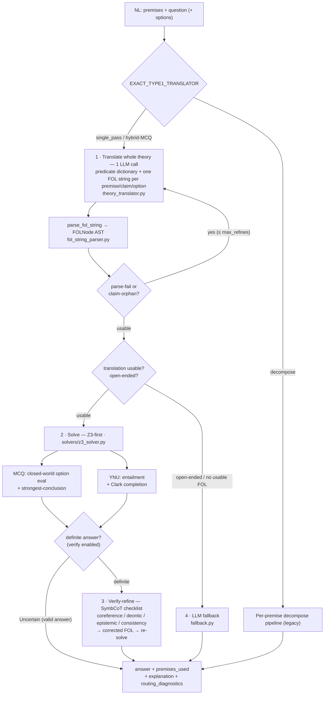

# Type 1 Solution — Neuro-Symbolic Logic QA (EXACT 2026)

How the Type 1 pipeline answers logic questions (MCQ / Yes-No-Uncertain / open-ended)
by translating natural language to first-order logic and deciding with Z3.

## Goal & constraints

- **Task:** Type 1 logic questions — MCQ (pick a label), YNU (Yes / No / Uncertain),
  open-ended (free-form).
- **Scoring:** `sample_score = 0.5·P1 + 0.5·P2`. **P1** = answer correct
  (`Unknown` ≡ `Uncertain`). **P2** = F1 over the 0-based `premises_used` index sets.
- **Latency budget:** ≤ 60 s per request.
- **Principle:** invest in *one good translation* and let **Z3 decide**; the LLM is a
  fallback, not the primary reasoner. A Z3 `Uncertain` on a faithful translation is a
  valid final answer, not a trigger to guess.

## Pipeline (single-pass, default)



Optional **self-consistency** (LINC): `EXACT_TYPE1_SELF_CONSISTENCY_SAMPLES > 1`
runs K translate→solve attempts and majority-votes; with adaptive-K it escalates
only when sample 1 is Uncertain.

## Why it's mostly symbolic (the core ideas)

### Whole-theory single-pass translation (Logic-LM / LINC)
Translating every premise + the question + options in **one** call with a shared
predicate dictionary keeps predicate names **consistent by construction**. The old
per-premise decomposition produced drift (`PriorityStatus` vs `HasPriorityStatus`,
`Weighs(x,2kg)` vs `Weight(x)<2`) that broke Z3 chaining → spurious `Uncertain`.

### FOL string grammar
The LLM emits standard ASCII FOL; `parse_fol_string` (recursive descent) turns it
into the same `FOLNode` AST the solver already used:
```
forall x: (Medical(x) & Weight(x) < 2) -> PriorityStatus(x)
exists x: Student(x) & ParticipatesIn(x, SocialWork)
```
Connectives `& | ~ -> <->`; quantifiers `forall/exists`; `Pred(args)`; comparisons
`Func(args) OP number`. Hyphenated constants (`MedKit-7`) supported.

### Closed-world reasoning (the EXACT datasets are CWA)
EXACT options/claims use "established **by the premises**" framing. Two mechanisms:

- **MCQ — CWA option evaluation:** an atom that is not provable is **false** (and its
  negation true). So `Searchable & ¬Safe` holds when `Searchable` is provable and
  `Safe` is not. When several options hold (a chain entails intermediates + the final
  one), pick the **strongest** = deepest derivation (largest premise support); tie →
  Uncertain.
- **YNU — Clark completion:** for predicates defined *only* by rules, add the only-if
  axiom `P(x) → (body₁ ∨ … ∨ bodₙ)`. A **known-false** requirement then forces
  `¬P` → **No**; an **unknown** requirement leaves it **Uncertain**. This is what
  distinguishes "requirement provably missing" (No) from "requirement not stated"
  (Uncertain).

### Verify-refine (SymbCoT)
A single checklist pass that re-checks the draft FOL against the premises and fixes
the recurring *systematic* translation errors (which self-consistency voting cannot,
because every sample repeats them). Runs only on a **definite** draft (where a
mistranslation is confidently wrong), keeping the latency budget.

## Translation rules (prompt-enforced)

1. Declare each predicate once; reuse the same name everywhere; keep the dict minimal.
2. **Consistency:** same relation → same predicate across premises/claim/options.
3. **Coreference:** one constant per real-world entity (the case = its server /
   passwords / report).
4. **Deontic:** "must not X without Y" / "requires Y" → a requirement predicate, not
   a disjunction.
5. **Epistemic premise:** "no premise states whether X" → empty string (no content),
   never `¬X`.
6. **Epistemic option:** "Y is not established by the premises" → `NOT(Y)` (closed-world).
7. **Numeric:** "under/at least N <unit>" → comparison `Func(x) OP N`.
8. **Polar vs MCQ:** a yes/no question with no listed options is **polar** (set claim,
   no invented options); MCQ only when options are listed.

## Configuration (env / `.env`)

| variable | default | meaning |
|---|---|---|
| `EXACT_TYPE1_TRANSLATOR` | `decompose`* | `single_pass` / `hybrid` / `decompose` (per-request override: `?translator=`) |
| `EXACT_TYPE1_SELF_CONSISTENCY_SAMPLES` | `1` | K for majority-vote self-consistency |
| `EXACT_TYPE1_SELF_CONSISTENCY_TEMPERATURE` | `0.7` | sampling temp when K>1 |
| `EXACT_TYPE1_SINGLE_PASS_MAX_REFINES` | `1` | bounded translate-refine retries |
| `EXACT_TYPE1_VERIFY_REFINE` | `true` | run the conditional verify pass |
| `EXACT_TYPE1_UNCERTAIN_TOKEN` | `Uncertain` | output token for uncertainty |
| `EXACT_TYPE1_PARSER_SOURCE_MODEL` | LLaMA-3.1-8B | translator/parser vLLM model |

\* `setup.sh` sets the deployed defaults to `single_pass`, `SAMPLES=1`, `VERIFY_REFINE=true`.

## Files

| file | role |
|---|---|
| `parser/theory_translator.py` | whole-theory translate + verify; `TheoryTranslation` |
| `parser/fol_string_parser.py` | ASCII FOL string → `FOLNode` AST |
| `solvers/z3_solver.py` | Z3 entailment, CWA MCQ scoring, Clark completion |
| `pipeline.py` | routing, `run_type1_single_pass`, adaptive-K vote, fallback |
| `prompts.py` | `get_system_prompt_theory_translate` / `_verify` |
| `fallback.py` | LLM fallback reasoner (open-ended / unusable only) |
| `parser/premise_parser.py`, `parser/question_parser.py`, … | decompose path (legacy/`hybrid`) |

## Paper grounding

- **Logic-LM** (EMNLP'23) — NL→symbolic + solver-error self-refinement.
- **LINC** (EMNLP'23) — LLM→FOL→prover + self-consistency majority vote.
- **SymbCoT** (ACL'24) — explicit translate → solve → **verify**.
- **ProofWriter** — closed-world (CWA) rule reasoning (Clark completion).

## Known limitations / next

- Translation quality is the ceiling: residual misses are coreference / deontic the
  verifier doesn't catch, and rare runaway generations (mitigated: caught → fallback).
- CWA can over-fire on a "cannot X" distractor whose X is genuinely unprovable; rare
  in EXACT, monitored on B07/B08.
- Multi-arg derived heads aren't Clark-completed (only unary) → stay Uncertain.
- Next levers: stronger coreference in translation, optional K≥2 vote within budget,
  faster/dedicated GPU to widen the latency headroom.

## Evaluation

- **`baselines/B07_eval_unified_predict.ipynb`** — replays the round-1 Type 1 set,
  scores P1/P2 the competition way, per-request latency, NL→FOL inspection.
- **`baselines/B08_eval_proofwriter.ipynb`** — bonus ProofWriter eval (CWA YNU).
